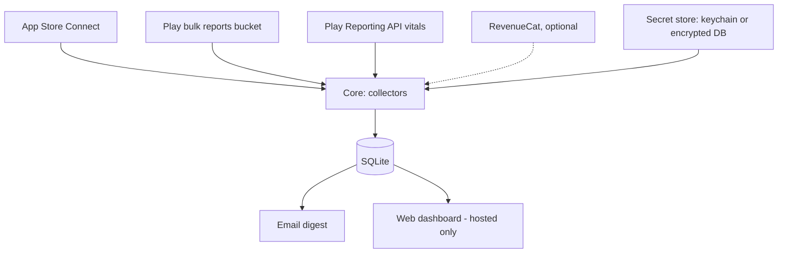

# Storepulse — open-source App Store + Google Play stats collector (spec)

Sep 25, 2026 · @Oleg

## Overview and goals

Storepulse (working name) is an open-source tool any developer can run to pull their own App Store Connect and Google Play data into one place. It comes in two modes: **local** sends a daily email; **hosted** (self-hosted on the user's own server) sends the email and serves a web dashboard. LogicFT's FT apps are the first user.

**Goals**

- One place to see installs, proceeds, and stability for all of a developer's apps on iOS and Android.
- Safe credential handling: keys are entered once through a guided setup, stored encrypted or in the OS keychain, never logged, and only ever sent to Apple, Google, and the user's own mail server.
- Zero-config app list: apps are discovered from the credentials, not typed in.
- Fully automated: one scheduled run per day, idempotent re-pulls.
- Easy install: `pipx install storepulse` for local, one `docker compose up` for hosted.

**Non-goals (v1)**

- A shared multi-tenant SaaS that stores other people's store keys (see Security model).
- Real-time data. Store reports lag one to three days by design.
- Ad attribution, cohort analysis, or in-app event analytics.
- Replacing RevenueCat's own dashboards.

## Open source project

- **License:** Apache-2.0 (patent grant, business-friendly); see Open decisions.
- **Repo:** public GitHub repo; LogicFT's private git remains the dev mirror if preferred. Releases to PyPI and a Docker image on GHCR.
- **Docs:** README with a 10-minute quickstart per mode, plus step-by-step guides with screenshots for creating the Apple API key and the Google service account (the hardest part for new users).
- **Hygiene:** `SECURITY.md` with a private disclosure address, `CONTRIBUTING.md`, CI running tests and linting on every PR, pinned dependencies with Dependabot, signed release tags.
- **No telemetry.** Nothing phones home, including version checks, unless the user opts in.

## Security model

The tool holds keys that can read a developer's sales data, so credential handling is the core design constraint.

- **Least privilege.** Setup guides request only read roles: Sales and Reports on Apple, *View app information and download bulk reports* on Play. The docs say plainly what each key can and cannot do.
- **Local mode:** secrets go in the OS keychain (macOS Keychain, Windows Credential Manager, Linux Secret Service) via the `keyring` library. On headless machines without a keychain, they go in an encrypted file unlocked by a passphrase or an env var.
- **Hosted mode:** secrets are uploaded once through the setup page, encrypted at rest with AES-GCM under a master key supplied only by environment variable or Docker secret, and never displayed again (the UI shows a fingerprint, the upload date, and a Test connection button).
- **Everywhere:** secrets are redacted from logs and error messages; raw report caches contain no credentials; the database without the master key reveals no keys.
- **Why not a shared SaaS:** a service holding thousands of developers' store keys is a high-value target and a liability. Self-hosting keeps each user's keys on infrastructure they control.

## Architecture

One shared core (collectors, SQLite, digest) is wrapped by two thin shells: a CLI for local mode and a web app for hosted mode.



|  | Local mode | Hosted mode |
| --- | --- | --- |
| Runs on | the user's Mac, Windows or Linux machine | the user's own VPS or home server |
| Install | `pipx install storepulse` | `docker compose up -d` |
| Setup | `storepulse init` terminal wizard | first-run web setup page |
| Secrets | OS keychain, or passphrase-encrypted file | AES-GCM in SQLite, master key from env |
| Scheduling | `storepulse schedule install` writes a cron, launchd or Task Scheduler entry | built-in scheduler in the container |
| Output | daily email | daily email + dashboard |
| Auth | none (single machine user) | one admin account, password + optional TOTP |

**Package layout**

```
storepulse/
  core/
    sources/apple_sales.py  apple_analytics.py  play_reports.py  play_vitals.py  revenuecat.py
    discovery.py      list apps from each credential
    config.py         non-secret settings (config.toml) and local paths
    db.py             schema, migrations, upserts
    secrets.py        SecretStore interface: KeyringStore, EncryptedFileStore, DbEncryptedStore
    digest.py         builds the email (HTML + plain text)
    mailer.py         SMTP sender
    runner.py         one run: collect → store → digest
  cli/                init wizard, run, backfill, status, schedule
  web/                FastAPI app: setup, login, dashboard, settings
  docker/             Dockerfile, compose.yaml, Caddy example
```

Local mode keeps its data in the platform's user data dir (via `platformdirs`); hosted mode uses a mounted `/data` volume.

## Data sources and auth

Four sources, each behind its own module in `core/sources/`. Each is optional: a user with only Android apps sets up only Google. Endpoint names and CSV columns below reflect the APIs as of mid-2026; verify them against current Apple and Google docs before coding each module.

**App discovery.** After credentials are saved, `discovery.py` lists apps automatically: `GET /v1/apps` on App Store Connect, and the Reporting API's app search on Play. Apps with the same name on both platforms are auto-paired into one logical app; users can rename, re-pair, or hide apps in settings.

| Source | Gives us | Auth | Freshness |
| --- | --- | --- | --- |
| App Store Connect sales reports | units, proceeds, by app and country | ES256 JWT from .p8 key | \~1 day lag |
| App Store Connect analytics reports | impressions, page views, downloads, sessions | same JWT | \~1–2 day lag |
| Play Console bulk reports bucket | installs, uninstalls, earnings, sales | service account, GCS read | 1–3 day lag, revised within month |
| Play Developer Reporting API | crash rate, ANR rate | same service account | \~2 day lag |
| RevenueCat API v2 (optional) | MRR, active subs, trials | secret API key | near real time |

### Apple: App Store Connect

- Create an API key in App Store Connect (Users and Access → Integrations) with the Sales and Reports role, plus App Manager or Admin if the analytics report requests must be created by the collector. Store the `.p8`, key ID, issuer ID, and vendor number.
- Sign a JWT per run: header `alg: ES256`, `kid: <key id>`; payload `iss: <issuer id>`, `aud: appstoreconnect-v1`, `exp` ≤ 20 minutes out.
- **Sales:** `GET /v1/salesReports` with `filter[frequency]=DAILY`, `filter[reportType]=SALES`, `filter[reportSubType]=SUMMARY`, `filter[vendorNumber]`, `filter[reportDate]=YYYY-MM-DD`. Response is a gzipped TSV. Map app rows to apps by Apple Identifier and in-app purchase rows by Parent Identifier (the parent app's SKU, kept in `kv` as `apple_sku:<sku>`); split by Product Type Identifier into first-time downloads (`installs`), redownloads, and in-app purchases (`iap_units`). Update rows and `IA3` (restored in-app purchase) rows add no unit metric. An empty Country Code is stored as `ZZ`, never `ALL`. When a day's in-app purchase rows arrive before their parent app is known, they are re-mapped at the end of the run, once a later day has registered the parent. Unrecognized product types are logged and counted; their proceeds still count. Apps seen in app rows but not in discovery are added automatically; IAP rows never add apps.
  - **404s:** a 404 whose detail says there were no sales is stored as a zero-sales day (clears that day's rows). "Not available yet" is `not_ready`. Any other 404 is `not_ready` for dates up to 2 days old and inferred no-sales for older dates; an inferred no-sales day never deletes stored rows (it logs a warning instead).
  - **Retention:** Apple keeps daily reports for about a year, so backfills are clamped to the last 365 days (Pacific time); earlier dates are skipped with a warning and never recorded.
  - **Auth:** the JWT is re-signed after 15 minutes so long backfills never run on an expired token.
- **Subscriptions:** same endpoint with `reportType=SUBSCRIPTION` / `SUBSCRIPTION_EVENT` for apps with subscriptions.
- **Analytics:** one-time setup per app: `POST /v1/analyticsReportRequests` with `accessType: ONGOING`. Daily: list the request's reports, pick the needed ones (downloads, discovery and engagement), fetch `DAILY` instances, download segment files (gzipped CSV). Store the request IDs in the DB so setup never repeats.

### Google: Play Console bulk reports

- Create a GCP service account; invite its email in Play Console → Users and permissions with *View app information and download bulk reports* for all apps. Download its JSON key.
- Bucket URI comes from Play Console → Download reports → Copy Cloud Storage URI (`gs://pubsite_prod_…`).
- Files to read:
  - `stats/installs/installs_<package>_<YYYYMM>_overview.csv` and `_country.csv`: daily installs, uninstalls, active devices.
  - `earnings/earnings_<YYYYMM>_*.zip`: transaction-level earnings in payout currency.
  - `sales/salesreport_<YYYYMM>.zip`: orders, if earnings lag too far.
- Gotcha: the installs CSVs are UTF-16 encoded. The current month's file is rewritten daily, so always re-parse it whole.

### Google: Play Developer Reporting API (vitals)

- Scope `https://www.googleapis.com/auth/playdeveloperreporting`, same service account.
- Query `crashRateMetricSet` and `anrRateMetricSet` per package with a DAILY timeline; keep user-perceived crash and ANR rates plus distinct users.
- Check each metric set's freshness before requesting the latest days.

### RevenueCat (optional)

- Secret v2 API key, read-only. Pull the project metrics overview once per run and store it as a dated snapshot (MRR, active subscriptions, active trials, revenue).

## Storage

One SQLite file (`storepulse.db` in the user data dir locally, `/data/storepulse.db` hosted; WAL mode) with a long, narrow fact table, so adding a metric never needs a migration.

```sql
CREATE TABLE apps (
  id          INTEGER PRIMARY KEY,
  name        TEXT NOT NULL,            -- 'deskFT'
  platform    TEXT NOT NULL CHECK (platform IN ('ios','android')),
  store_id    TEXT NOT NULL,            -- Apple ID or package name
  UNIQUE (platform, store_id)
);

CREATE TABLE daily_metrics (
  date        TEXT NOT NULL,            -- YYYY-MM-DD, store's reporting day
  app_id      INTEGER NOT NULL REFERENCES apps(id),
  country     TEXT NOT NULL DEFAULT 'ALL', -- ISO 3166 alpha-2 or 'ALL'
  metric      TEXT NOT NULL,
  currency    TEXT NOT NULL DEFAULT '', -- '' for non-money metrics
  value       REAL NOT NULL,
  source      TEXT NOT NULL,            -- 'apple_sales', 'play_installs', …
  updated_at  TEXT NOT NULL,
  PRIMARY KEY (date, app_id, country, metric, currency)
);

CREATE TABLE snapshots (               -- point-in-time values (RevenueCat)
  taken_at TEXT NOT NULL, app_id INTEGER, metric TEXT NOT NULL,
  currency TEXT NOT NULL DEFAULT '', value REAL NOT NULL,
  PRIMARY KEY (taken_at, app_id, metric, currency)
);

CREATE TABLE ingest_log (
  id INTEGER PRIMARY KEY, source TEXT NOT NULL, report_date TEXT NOT NULL,
  started_at TEXT NOT NULL, finished_at TEXT,
  status TEXT NOT NULL CHECK (status IN ('ok','not_ready','error')),
  rows INTEGER, error TEXT
);

CREATE TABLE kv (key TEXT PRIMARY KEY, value TEXT);  -- analytics request IDs, Apple SKU map, schema version
```

**Metric vocabulary** (fixed list in `db.py`; unknown metrics are rejected):

| Metric | Unit | Sources |
| --- | --- | --- |
| `installs` | count | apple\_sales (first-time), play\_installs |
| `redownloads` | count | apple\_sales |
| `uninstalls` | count | play\_installs |
| `active_devices` | count | play\_installs |
| `proceeds` | money | apple\_sales, play\_earnings |
| `iap_units` | count | apple\_sales |
| `impressions`, `page_views` | count | apple\_analytics |
| `crash_rate`, `anr_rate` | ratio 0–1 | play\_vitals |

**Rules**

- Every write is `INSERT … ON CONFLICT DO UPDATE`, so re-pulls overwrite and never duplicate.
- A re-pull for one source and date replaces that source's rows for that date inside one transaction (delete, then insert) so countries that dropped to zero don't linger.
- Money is stored in the original currency; conversion happens at render time (see Open decisions).
- `country = 'ALL'` rows are written only where the source gives a total; otherwise the renderer sums countries. `apple_sales` writes no `ALL` rows, so readers sum its countries. Unknown countries are `ZZ`, never `ALL`.
- A row belongs to the source that wrote it. Another source writing the same key fails loudly and changes nothing; it never takes the row over.

**Hosted-mode additions**

```sql
CREATE TABLE secrets (
  name        TEXT PRIMARY KEY,   -- 'apple_p8', 'google_sa', 'smtp_password', …
  ciphertext  BLOB NOT NULL,      -- AES-GCM, key derived from STOREPULSE_MASTER_KEY
  nonce       BLOB NOT NULL,
  fingerprint TEXT NOT NULL,      -- shown in UI instead of the secret
  updated_at  TEXT NOT NULL
);

CREATE TABLE users (
  id INTEGER PRIMARY KEY, email TEXT UNIQUE NOT NULL,
  password_hash TEXT NOT NULL,    -- argon2id
  totp_secret_enc BLOB            -- optional, encrypted like secrets
);
```

The `apps` table gains `display_name`, `pair_key` (links an iOS and Android app into one logical app), and `hidden`.

## Scheduling and reliability

One run per day (default 10:30 in the user's time zone) re-pulls the last 7 days from every configured source, absorbing store lag and late revisions.

- **Local:** `storepulse schedule install` writes a crontab line (Linux), a launchd agent (macOS), or a Task Scheduler task (Windows); `schedule remove` undoes it. If the machine was asleep at run time, the next run catches up because of the 7-day window.
- **Hosted:** an in-process scheduler (APScheduler) in the container; the run time is set in settings. A Run now button triggers an immediate run.

**CLI** (both modes; in Docker via `docker compose exec`)

- `storepulse init` — guided setup (see Credentials and setup).
- `storepulse run` — pull last N days, store, send digest.
- `storepulse backfill --source apple_sales --from 2025-01-01` — historical load, rate-limited.
- `storepulse digest --dry-run` — print or open the digest instead of sending it.
- `storepulse status` — last result per source and date, highlighting gaps.
- `storepulse doctor` — tests every credential and SMTP without pulling data.

**Error handling**

- Sources run independently: one failing source never blocks the others or the digest.
- "Report not available yet" is logged as `not_ready`, not `error`, and is retried by tomorrow's window.
- HTTP 429 and 5xx retry with exponential backoff (3 attempts); auth errors fail fast with a message that says which credential and which permission to check. The message always includes the store's own reason. Apple's `FORBIDDEN.REQUIRED_AGREEMENTS_MISSING_OR_EXPIRED` means the Account Holder must accept an updated agreement; it is not a key-role problem.
- A new Google service account can take up to a day or two before Play permissions take effect; `doctor` detects this and says so instead of reporting a generic 403.
- Raw downloaded files are cached for 30 days so parsers can be fixed and re-run without re-downloading.
- A lock prevents overlapping runs.
- Any `error`, or a date still `not_ready` after 4 days, is flagged in the digest.

## Outputs

### Daily email (both modes)

Sent through the user's own SMTP server (Gmail or Fastmail app password, SES, Postmark, etc.), so no Storepulse-run mail service is needed.

- HTML body with plain-text fallback; charts rendered server-side as small PNG images embedded inline (email clients strip SVG and JavaScript).
- Contents: yesterday and 7-day totals vs the previous 7 days, per-app rows with a 30-day installs sparkline, proceeds in the chosen currency, vitals warnings, and data freshness per source.
- Optional weekly summary email and optional CSV attachment of the week's data.
- In hosted mode the email links to the dashboard.

```
Storepulse · Thu Sep 24
Installs  142 (+18% wk)   iOS 61 · Android 81
Proceeds  CA$213 (−4% wk)
Top app   deskFT 58 installs
Vitals    billFT Android crash rate 1.4% ⚠
Data      apple_sales ok · play_installs ok (Sep 22) · vitals ok
```

Warnings: crash rate above 1.09% or ANR rate above 0.47% (Google Play's bad-behavior thresholds, configurable), a source erroring, or data older than 4 days.

### Web dashboard (hosted only)

Server-rendered pages (FastAPI + Jinja, Chart.js bundled locally, no CDN), behind login.

- **Overview:** all apps combined — installs, proceeds, crash rate, with 7/30/90-day ranges.
- **App page:** iOS and Android side by side; installs, proceeds, countries, vitals.
- **Sources page:** freshness and last error per source; Run now.
- **Settings:** credentials (fingerprints only, replace or remove), SMTP, schedule, currency, thresholds, app pairing.
- Mobile-friendly; HTTPS is expected via a reverse proxy (Caddy example included; Apache and nginx snippets in docs).

## Credentials and setup

Setup is a guided flow that validates each credential live before saving it, so a user never finds out on day two that a key was wrong.

**Flow (same steps in the CLI wizard and the web setup page)**

1. **Apple (optional):** paste issuer ID and key ID, point to or upload the `.p8`, enter vendor number. Storepulse signs a test JWT, calls `GET /v1/apps`, and shows the apps it found.
2. **Google (optional):** upload the service account JSON, paste the bucket URI. Storepulse lists the bucket and calls the Reporting API, then shows the apps found — or explains a pending-permission delay.
3. **RevenueCat (optional):** paste a read-only v2 key and project ID.
4. **Email:** SMTP host, port, username, password, from and to addresses; sends a test email.
5. **Preferences:** currency, run time, time zone, backfill depth. Then an optional first backfill.
6. **Hosted only, first:** before any of the above, create the admin account (argon2id password, optional TOTP). The setup page is reachable only until an admin exists and requires a one-time setup token printed in the container log.

**Where each thing lives**

| Item | Local mode | Hosted mode |
| --- | --- | --- |
| `.p8`, service account JSON, API keys, SMTP password | OS keychain (or encrypted file) | `secrets` table, AES-GCM |
| Master key | n/a (keychain) or passphrase | `STOREPULSE_MASTER_KEY` env var or Docker secret |
| Non-secret settings | `config.toml` in the user config dir | `settings` table |
| Data | user data dir | `/data` volume |

- The original key files can be deleted after import; the docs recommend it.
- Secrets are never returned by the API or shown in the UI after saving; replacing one requires the admin password again.
- `storepulse export-config` writes non-secret settings only; secrets are re-entered on a new machine by design.
- Losing the hosted master key means re-entering credentials, not losing data.

## Build phases for Claude Code

Local mode ships first as v0.1 because it is the core plus a CLI; hosted mode wraps the same core as v0.2. Each phase is its own Claude Code task.

1. **Repo + core + Apple sales**
   - Public repo skeleton: license, README stub, `SECURITY.md`, CI (tests, ruff, mypy), `SecretStore` interface with `KeyringStore` and `EncryptedFileStore`.
   - SQLite schema with versioned migrations; Apple JWT, discovery, `salesReports` parser.
   - *Done when:* `storepulse init` saves Apple credentials to the keychain, a 90-day backfill loads, re-runs don't change row counts, and totals match App Store Connect for three sample days.
2. **Google: bulk reports + vitals**
   - GCS reader, UTF-16 installs parser, earnings parser, vitals metric sets, Play discovery, `doctor` checks.
   - *Done when:* last month's installs match Play Console within 1% and vitals match Android vitals.
3. **Email digest + scheduler → release v0.1 (local)**
   - SMTP mailer, HTML + text digest with inline PNG charts, thresholds, `schedule install` for Linux, macOS, and Windows.
   - *Done when:* a fresh machine goes from `pipx install` to a received digest in under 15 minutes following the README; published to PyPI.

**3b. Apple subscription reports** (added after Phase 3, so the later phase numbers stay the same)
- Daily `SALES/SUBSCRIPTION` and `SUBSCRIPTION_EVENT` reports from `GET /v1/salesReports`. Metrics for active subscriptions, trials and churn events are added to the vocabulary in this phase.
- Until then, auto-renewable subscription revenue still arrives through `IAY` rows in the daily SALES report; only the subscription state (active, trial, churn) is missing.
- Overlaps with the open "Revenue source" decision: if RevenueCat is chosen, this phase is limited to what RevenueCat doesn't cover.
- *Done when:* active subscriptions and trials match App Store Connect's Subscriptions dashboard for three sample days, and re-runs don't change row counts.

4. **Hosted shell → release v0.2 (hosted)**
   - FastAPI app, admin account + TOTP, setup token, `DbEncryptedStore`, web setup flow, dashboard pages, in-process scheduler, Dockerfile, compose file, Caddy example.
   - *Done when:* `docker compose up` to working dashboard and email in under 15 minutes; secrets are unreadable in the DB without the master key; image published to GHCR.
5. **Security review**
   - Dependency audit, secret-redaction tests (grep logs and error pages for key material), CSRF and session tests, rate-limited login.
   - *Done when:* checklist in `SECURITY.md` passes and a second reviewer (Claude review pass) finds no open high-severity issues.
6. **Apple analytics + RevenueCat → v0.3**
   - One-time analytics report request setup, segment downloads; RevenueCat snapshots.
   - *Done when:* impressions and page views appear per iOS app and setup is not repeated on later runs.

For every phase: parser unit tests against scrubbed sample reports in `tests/fixtures/`, no network calls in tests, and LogicFT's own FT apps as the live dogfood account.

## Open decisions

- [ ] **Revenue source.** Store reports for everything (simpler, messier for subscriptions) or stores for installs and vitals plus RevenueCat for revenue (cleaner MRR, trials, churn; one more key).
- [ ] **Currency conversion.** Convert at render time with a daily ECB reference rate cached in `kv` (current draft), or at ingest into one currency chosen at setup.
- [ ] **Language.** Python (current draft: mature JWT, GCS, keyring, and web libraries; `pipx` install) or Go for a single static binary that non-Python users install more easily.
- [ ] **License.** Apache-2.0 (current draft) or MIT for maximum adoption, or AGPL-3.0 if anyone running a modified version as a public service should have to share their changes. This also affects whether LogicFT could later sell a managed, per-customer-isolated hosted version.
- [ ] **Name.** Storepulse is a placeholder; check PyPI, GitHub, and trademark conflicts before the first public release.
- [ ] **Backfill depth.** How far back to load on first run (Apple sales keeps daily reports for about a year; Play bucket files go back to each app's launch).
