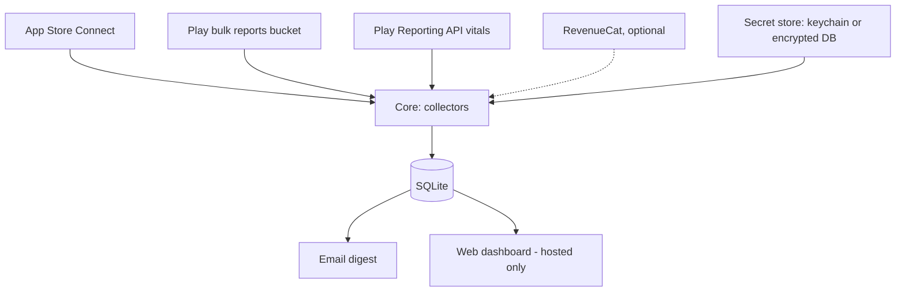

# Storepulse — open-source App Store + Google Play stats collector (spec)

Sep 25, 2026 · @Oleg

## Overview and goals

Storepulse is an open-source tool any developer can run to pull their own App Store Connect and Google Play data into one place. It comes in two modes: **local** sends a daily email; **hosted** (self-hosted on the user's own server) sends the email and serves a web dashboard. LogicFT's FT apps are the first user.

**Goals**

- One place to see installs, proceeds, and stability for all of a developer's apps on iOS and Android.
- Safe credential handling: keys are entered once through a guided setup, stored encrypted or in the OS keychain, never logged, and only ever sent to Apple, Google, and the user's own mail server.
- Zero-config app list: apps are discovered from the credentials, not typed in.
- Fully automated: one scheduled run per day, idempotent re-pulls.
- Easy install: `pipx install storepulse` for local, one `docker compose up` for hosted.

**Non-goals (v1)**

- A shared multi-tenant SaaS that stores other people's store keys (see Security model).
- Real-time data. Store reports lag one to three days by design.
- Ad attribution, cohort analysis, or in-app event analytics.
- Replacing RevenueCat's own dashboards.

## Open source project

- **License:** Apache-2.0 (patent grant, business-friendly); confirmed, see Open decisions.
- **Repo:** public GitHub repo; LogicFT's private git remains the dev mirror if preferred. Releases to PyPI and a Docker image on GHCR.
- **Docs:** README with a 10-minute quickstart per mode, plus step-by-step guides with screenshots for creating the Apple API key and the Google service account (the hardest part for new users).
- **Hygiene:** `SECURITY.md` with a private disclosure address, `CONTRIBUTING.md`, CI running tests and linting on every PR, pinned dependencies with Dependabot, signed release tags.
- **No telemetry.** Nothing phones home, including version checks, unless the user opts in.

## Security model

The tool holds keys that can read a developer's sales data, so credential handling is the core design constraint.

- **Least privilege.** Setup guides request only read roles: Sales and Reports on Apple, *View app information and download bulk reports* on Play. Android revenue additionally needs Play's *View financial data, orders, and cancellation survey responses* (global). It is **optional**: it also exposes order details and buyers' city, state and postcode (Storepulse keeps only the country), so without it Storepulse still collects installs and vitals and `doctor` warns that Android revenue is off. The docs say plainly what each key and permission can and cannot do.
- **Local mode:** secrets go in the OS keychain (macOS Keychain, Windows Credential Manager, Linux Secret Service) via the `keyring` library. On headless machines without a keychain, they go in an encrypted file unlocked by a passphrase or an env var.
  - Secrets over 1 KB, such as a service-account JSON, exceed Windows Credential Manager's size limit.
  - These are AES-GCM encrypted into `keychain-wrapped.json` under a random key kept in the keychain, and the keychain entry holds only a marker.
- **Hosted mode:** secrets are uploaded once through the setup page, encrypted at rest with AES-GCM under a master key supplied only by environment variable or Docker secret, and never displayed again (the UI shows a fingerprint, the upload date, and a Test connection button).
- **Everywhere:** secrets are redacted from logs and error messages; raw report caches contain no credentials; the database without the master key reveals no keys.
- **Why not a shared SaaS:** a service holding thousands of developers' store keys is a high-value target and a liability. Self-hosting keeps each user's keys on infrastructure they control.

## Architecture

One shared core (collectors, SQLite, digest) is wrapped by two thin shells: a CLI for local mode and a web app for hosted mode.



|  | Local mode | Hosted mode |
| --- | --- | --- |
| Runs on | the user's Mac, Windows or Linux machine | the user's own VPS or home server |
| Install | `pipx install storepulse` | `docker compose up -d` |
| Setup | `storepulse init` terminal wizard | first-run web setup page |
| Secrets | OS keychain, or passphrase-encrypted file | AES-GCM in SQLite, master key from env |
| Scheduling | `storepulse schedule install` writes a cron, launchd or Task Scheduler entry | built-in scheduler in the container |
| Output | daily email | daily email + dashboard |
| Auth | none (single machine user) | one admin account, password + optional TOTP |

**Package layout**

```
storepulse/
  core/
    sources/apple_client.py  apple_sales.py  apple_subscriptions.py  apple_subscription_events.py
            apple_analytics.py  google_auth.py  google_client.py  play_common.py  play_installs.py
            play_sales.py  play_earnings.py  play_vitals.py  revenuecat.py
    discovery.py      list apps from each credential
    config.py         non-secret settings (config.toml) and local paths
    db.py             schema, migrations, upserts
    secrets.py        SecretStore interface: KeyringStore, EncryptedFileStore, DbEncryptedStore
    digest.py         builds the email (HTML + plain text)
    mailer.py         SMTP sender
    runner.py         one run: collect → store → digest
  cli/                init wizard, run, backfill, status, schedule
  web/                FastAPI app: setup, login, dashboard, settings
  docker/             Dockerfile, compose.yaml, Caddy example
```

Local mode keeps its data in the platform's user data dir (via `platformdirs`); hosted mode uses a mounted `/data` volume.

## Data sources and auth

Four sources, each behind its own module in `core/sources/`. Each is optional: a user with only Android apps sets up only Google. Endpoint names and CSV columns below reflect the APIs as of mid-2026; verify them against current Apple and Google docs before coding each module.

**App discovery.** After credentials are saved, `discovery.py` lists apps automatically: `GET /v1/apps` on App Store Connect, and the Reporting API's app search on Play. It auto-pairs an iOS and an Android app into one logical app when their store-reported names (`apps.name`, never a user's `display_name`) match exactly once normalized (case, whitespace) and the match is 1:1 — exactly one app per platform has that name. Two apps on one platform sharing a name (LogicFT's own account has two Android apps both called "Bus Wise") are never auto-paired by guesswork; that's left for a user to resolve by hand in settings, like any other rename, re-pair, or hide. Because Play discovery re-runs on every collection, auto-pairing must be idempotent against a user's own choices — see Storage's `pair_source`. Auto pairs are re-evaluated on every run: one that no longer matches 1:1 (a store rename, or a second same-named app appearing) drops back to unpaired and undecided. `display_name` and `hidden` are written only through settings; discovery never touches them.

| Source | Gives us | Auth | Freshness |
| --- | --- | --- | --- |
| App Store Connect sales reports | units, proceeds, by app and country | ES256 JWT from .p8 key | \~1 day lag |
| App Store Connect analytics reports | impressions, page views, downloads, sessions | same JWT | \~1–2 day lag |
| Play Console bulk reports bucket | installs, uninstalls, earnings, sales | service account, GCS read | 1–3 day lag, revised within month |
| Play Developer Reporting API | crash rate, ANR rate | same service account | \~2 day lag |
| RevenueCat API v2 (optional) | MRR, active subs, trials | secret API key | near real time |

### Apple: App Store Connect

- Create an API key in App Store Connect (Users and Access → Integrations) with the Sales and Reports role, plus App Manager or Admin if the analytics report requests must be created by the collector. Store the `.p8`, key ID, issuer ID, and vendor number.
- Sign a JWT per run: header `alg: ES256`, `kid: <key id>`; payload `iss: <issuer id>`, `aud: appstoreconnect-v1`, `exp` ≤ 20 minutes out.
- **Sales:** `GET /v1/salesReports` with `filter[frequency]=DAILY`, `filter[reportType]=SALES`, `filter[reportSubType]=SUMMARY`, `filter[vendorNumber]`, `filter[reportDate]=YYYY-MM-DD`. Response is a gzipped TSV. Map app rows to apps by Apple Identifier and in-app purchase rows by Parent Identifier (the parent app's SKU, kept in `kv` as `apple_sku:<sku>`); split by Product Type Identifier into first-time downloads (`installs`), redownloads, and in-app purchases (`iap_units`). Update rows and `IA3` (restored in-app purchase) rows add no unit metric. An empty Country Code is stored as `ZZ`, never `ALL`. When a day's in-app purchase rows arrive before their parent app is known, they are re-mapped at the end of the run, once a later day has registered the parent. Unrecognized product types are logged and counted; their proceeds still count. Apps seen in app rows but not in discovery are added automatically; IAP rows never add apps.
  - **404s:** a 404 whose detail says there were no sales is stored as a zero-sales day (clears that day's rows). "Not available yet" is `not_ready`. Any other 404 is `not_ready` for dates up to 2 days old and inferred no-sales for older dates; an inferred no-sales day never deletes stored rows (it logs a warning instead).
  - **Retention:** Apple keeps daily reports for about a year, so backfills are clamped to the last 365 days (Pacific time); earlier dates are skipped with a warning and never recorded.
  - **Auth:** the JWT is re-signed after 15 minutes so long backfills never run on an expired token.
- **Subscriptions:** `GET /v1/salesReports` with `filter[frequency]=DAILY`, `filter[reportType]=SUBSCRIPTION`, `filter[reportSubType]=SUMMARY`, `filter[version]=1_3`, `filter[vendorNumber]`, `filter[reportDate]=YYYY-MM-DD` — the same endpoint as Sales, and the one real divergence from it: every `/v1/salesReports` report type needs `filter[reportSubType]=SUMMARY`, but only Subscription and Subscription Event additionally require `filter[version]=1_3`. Response is a gzipped TSV, one row per (app, subscription, country, device, client, state) segment for that day — a snapshot, not an event log, so active counts are already aggregated into named columns rather than one row per subscriber. Rows resolve to an app by App Apple ID directly (no parent-SKU indirection, unlike Sales' in-app-purchase rows), and this source never registers a new app. `active_subscriptions` sums every "active" column except the four free-trial ones (Standard Price; the paid Pay Up Front and Pay As You Go columns for the Introductory Offer, Promotional Offer, Offer Code and Win-Back families, 2 each; Marketing Opt-Ins; Billing Retry; Grace Period — 12 columns in total). `active_trials` sums exactly those four free-trial columns (one per family: Introductory Offer, Promotional Offer, Offer Code, Win-Back). The `Subscribers` column is a distinct per-segment headcount, not a subscription-instance count, and is not used by either metric. 404s, retention and JWT handling are identical to Sales (`classify_404`, the 365-day Pacific clamp, and the 15-minute re-sign); a day with no rows for an app means zero active subscriptions, and either way nothing is written (Storage's "absence means zero"). Both metrics write a per-country row plus a self-computed `country='ALL'` total (Storepulse sums the segments itself; unlike `play_installs`, Apple's report has no separate worldwide file to draw the total from) — a future reader should use `all_only=True` against it, the same convention `play_installs`' `ALL` row already uses.
- **Subscription events:** same endpoint and `filter[version]=1_3`, with `filter[reportType]=SUBSCRIPTION_EVENT`. Unlike the Subscription report, this is an event log: one row per distinct event occurrence that day, with a `Quantity` column aggregating repeats of the same event/segment. Rows resolve to an app by App Apple ID directly, same as the Subscription report, and this source never registers a new app either. `subscription_churn` sums `Quantity` for rows whose `Event` is `Cancel`, `Canceled from Billing Retry`, or `Refund`; every other recognized event (`Renew`, `Start Introductory Price`, `Paid Subscription from Introductory Price`, offer starts, upgrades/downgrades/crossgrades, reactivations, billing-retry transitions) is acknowledged but contributes to no metric, the same treatment Sales gives an `IA3` restore. An `Event` value outside both sets is logged and counted, never fails the run — the same treatment as an unrecognized Product Type Identifier. Writes a per-country row plus a self-computed `country='ALL'` total, same convention as the Subscription report above.
- Subscription revenue is unaffected by either report: `IAY` rows in the daily Sales report still own `proceeds` for auto-renewable subscriptions; neither new source ever writes a `proceeds` metric, only subscription-state counts (Storage's "a row belongs to the source that wrote it" rule would reject a stray write anyway).
- **Not built:** Apple also publishes a `SUBSCRIBER` report — a per-subscriber transaction log with a stable Subscriber ID, useful for cohort/LTV analysis. The Subscription report already gives the pre-aggregated active/trial counts this phase needs, so the Subscriber report is a noted future option, not built now.
- **Analytics:** one-time setup per app: `POST /v1/analyticsReportRequests` with `accessType: ONGOING`. Daily: list the request's reports, pick the needed ones (downloads, discovery and engagement), fetch `DAILY` instances, download segment files (gzipped CSV). Store the request IDs in the DB so setup never repeats.

### Google: Play Console bulk reports

- Create a GCP service account; invite its email in Play Console → Users and permissions with *View app information and download bulk reports* for all apps. Download its JSON key.
- Bucket URI comes from Play Console → Download reports → Copy Cloud Storage URI (`gs://pubsite_prod_…`).
- Files to read:
  - `stats/installs/installs_<package>_<YYYYMM>_overview.csv` and `_country.csv`: daily installs, uninstalls, active devices.
  - `earnings/earnings_<YYYYMM>_*.zip`: transaction-level earnings in payout currency.
  - `sales/salesreport_<YYYYMM>.zip`: orders, if earnings lag too far.
- Gotcha: the installs CSVs are UTF-16 encoded. The current month's file is rewritten daily, so always re-parse it whole.
- **Installs:**
  - `installs` = Daily User Installs, `uninstalls` = Daily User Uninstalls, `active_devices` = Active Device Installs. These match Play Console's user acquisitions and user losses, not device acquisitions.
  - The overview file gives the `ALL` rows and the country file gives per-country rows. Both are written in one replacement per app and month.
  - An empty cell is missing data, not zero.
- **Proceeds:**
  - `play_sales` writes `sales_gross`: provisional gross sales from the daily-updated sales report. Item price excluding tax, in the buyer's currency, before Google's fee. `Refund` rows subtract the absolute item price. Never stored as `proceeds`, which is net for every source.
  - `play_earnings` writes `proceeds`: final net proceeds from the monthly earnings report. Merchant currency, including fee and tax lines. Rows dated outside the file's month are moved to the month's nearest edge (never dropped), so the month still reconciles with the payout. Rows with no known package are skipped, and their amount per currency is recorded in the ingest note.
  - Loading a month's earnings deletes that month's `play_sales` rows in the same transaction, and later sales re-pulls skip the month.
  - Both need the optional financial permission. When an account-wide prefix (`sales/`, `earnings/`) lists no files at all, collection warns and names that permission instead of silently skipping.
- **Discovery:** every Play collection re-runs app discovery (`apps:search`, falling back to the packages in the bucket's installs file names), so apps launched after setup are collected. `doctor` registers the apps it sees.
- **Missing months:**
  - Months before the first file are skipped, with nothing logged. For installs the first file is per app; sales and earnings files cover the whole account, so their first file is account-wide.
  - A missing current month is `not_ready`, as is last month's earnings before the 15th. Any other missing past month is logged `ok` with 0 rows and a "no file" note.

### Google: Play Developer Reporting API (vitals)

- Scope `https://www.googleapis.com/auth/playdeveloperreporting`, same service account.
- Query `crashRateMetricSet` and `anrRateMetricSet` per package with a DAILY timeline; keep user-perceived crash and ANR rates plus distinct users.
  - Also keep the 28-day user-weighted rates (`userPerceivedCrashRate28dUserWeighted`, `userPerceivedAnrRate28dUserWeighted`). Google's bad-behavior thresholds apply to these, and alerts must use them. Daily rates for small apps swing too much.
- Check each metric set's freshness before requesting the latest days. DAILY `latestEndTime` is exclusive, and later days are `not_ready`.
- **Auth:** the service account JSON is exchanged for an OAuth token directly: an RS256 JWT assertion to `token_uri`. A 403 after a successful token exchange means Play Console hasn't granted the permission yet, which can take 24–48 hours for a new account.

### RevenueCat (optional)

- Secret v2 API key, read-only. Pull the project metrics overview once per run and store it as a dated snapshot (MRR, active subscriptions, active trials, revenue).

## Storage

One SQLite file (`storepulse.db` in the user data dir locally, `/data/storepulse.db` hosted; WAL mode) with a long, narrow fact table, so adding a metric never needs a migration.

```sql
CREATE TABLE apps (
  id          INTEGER PRIMARY KEY,
  name        TEXT NOT NULL,            -- 'deskFT'
  platform    TEXT NOT NULL CHECK (platform IN ('ios','android')),
  store_id    TEXT NOT NULL,            -- Apple ID or package name
  UNIQUE (platform, store_id)
);

CREATE TABLE daily_metrics (
  date        TEXT NOT NULL,            -- YYYY-MM-DD, store's reporting day
  app_id      INTEGER NOT NULL REFERENCES apps(id),
  country     TEXT NOT NULL DEFAULT 'ALL', -- ISO 3166 alpha-2 or 'ALL'
  metric      TEXT NOT NULL,
  currency    TEXT NOT NULL DEFAULT '', -- '' for non-money metrics
  value       REAL NOT NULL,
  source      TEXT NOT NULL,            -- 'apple_sales', 'play_installs', …
  updated_at  TEXT NOT NULL,
  PRIMARY KEY (date, app_id, country, metric, currency)
);

CREATE TABLE snapshots (               -- point-in-time values (RevenueCat)
  taken_at TEXT NOT NULL, app_id INTEGER, metric TEXT NOT NULL,
  currency TEXT NOT NULL DEFAULT '', value REAL NOT NULL,
  PRIMARY KEY (taken_at, app_id, metric, currency)
);

CREATE TABLE ingest_log (
  id INTEGER PRIMARY KEY, source TEXT NOT NULL, report_date TEXT NOT NULL,
  started_at TEXT NOT NULL, finished_at TEXT,
  status TEXT NOT NULL CHECK (status IN ('ok','not_ready','error')),
  rows INTEGER, error TEXT,
  app_id INTEGER REFERENCES apps(id)  -- set for a per-app source (play_installs, play_vitals);
                                       -- NULL for an account-wide one (apple_sales,
                                       -- apple_subscriptions, apple_subscription_events,
                                       -- play_sales, play_earnings), where report_date alone
                                       -- identifies a pull
);

CREATE TABLE kv (key TEXT PRIMARY KEY, value TEXT);  -- analytics request IDs, Apple SKU map, schema version
```

**Metric vocabulary** (fixed list in `db.py`; unknown metrics are rejected):

| Metric | Unit | Sources | Over several days |
| --- | --- | --- | --- |
| `installs` | count | apple\_sales (first-time), play\_installs | sum |
| `redownloads` | count | apple\_sales | sum |
| `uninstalls` | count | play\_installs | sum |
| `active_devices` | count (snapshot) | play\_installs | last value |
| `proceeds` | money, net | apple\_sales, play\_earnings | sum (per currency) |
| `sales_gross` | money, gross, provisional | play\_sales | sum (per currency) |
| `iap_units` | count | apple\_sales | sum |
| `impressions`, `page_views` | count | apple\_analytics | sum |
| `crash_rate`, `anr_rate` | ratio 0–1, daily | play\_vitals | mean weighted by `vitals_users` |
| `crash_rate_28d`, `anr_rate_28d` | ratio 0–1, 28-day user-weighted | play\_vitals | last value (already a 28-day window) |
| `vitals_users` | count (distinct users in the crash-rate metric set; a snapshot, not additive) | play\_vitals | last value |
| `active_subscriptions` | count (snapshot) | apple\_subscriptions | last value |
| `active_trials` | count (snapshot) | apple\_subscriptions | last value |
| `subscription_churn` | count | apple\_subscription\_events | sum |

**Rules**

- Every write is `INSERT … ON CONFLICT DO UPDATE`, so re-pulls overwrite and never duplicate.
- A re-pull for one source and date replaces that source's rows for that date inside one transaction (delete, then insert) so countries that dropped to zero don't linger.
- Money is stored in the original currency. The digest lists proceeds per currency; a converted total is shown only when `config.toml` sets fixed rates and a display currency (Phase 3 decision — see Open decisions).
- `country = 'ALL'` rows are written only where the source gives a total; otherwise the renderer sums countries. Per source: `play_installs` writes both, and readers use its `ALL` row and never add the countries to it; `apple_sales` writes no `ALL` rows, so readers sum its countries. Unknown countries are `ZZ`, never `ALL`.
- Month-based sources replace a whole month per app, or per account for sales and earnings, in one transaction.
- A row belongs to the source that wrote it. Another source writing the same key fails loudly and changes nothing; it never takes the row over. Provisional `play_sales` rows are the one planned hand-over: `play_earnings` deletes them explicitly in the same transaction.

**Hosted-mode additions**

```sql
CREATE TABLE secrets (
  name        TEXT PRIMARY KEY,   -- 'apple_p8', 'google_sa', 'smtp_password', …
  ciphertext  BLOB NOT NULL,      -- AES-GCM, key derived from STOREPULSE_MASTER_KEY
  nonce       BLOB NOT NULL,
  fingerprint TEXT NOT NULL,      -- shown in UI instead of the secret; a keyed HMAC, so the DB alone can't test guesses
  updated_at  TEXT NOT NULL
);

CREATE TABLE users (
  id INTEGER PRIMARY KEY, email TEXT UNIQUE NOT NULL,
  password_hash TEXT NOT NULL,    -- argon2id
  totp_secret_enc BLOB            -- optional, encrypted like secrets
);

CREATE TABLE settings (
  key         TEXT PRIMARY KEY,   -- 'apple.vendor_number', 'schedule.run_time', 'digest.rates', …
  value       TEXT NOT NULL,      -- JSON-encoded
  updated_at  TEXT NOT NULL
);

CREATE TABLE sessions (           -- server-side login sessions
  token_hash   TEXT PRIMARY KEY,  -- sha256 of the cookie token; the token itself is never stored
  user_id      INTEGER NOT NULL REFERENCES users(id) ON DELETE CASCADE,
  csrf_token   TEXT NOT NULL,     -- required on every POST form
  totp_pending INTEGER NOT NULL DEFAULT 0,  -- password accepted, second factor not yet
  created_at   TEXT NOT NULL,
  expires_at   TEXT NOT NULL
);
```

Hosted-only settings live under the `hosted.` prefix, outside `Config`: `hosted.timezone` (the scheduler's time zone), `hosted.base_url` (the dashboard link in emails), the one-time setup token's hash while no admin exists, and a sealed TOTP secret during enrolment.

Everything non-secret that local mode keeps in `config.toml` lives here instead: every field of `core/config.py`'s `Config` dataclass except `secret_store` (hosted mode only ever uses `DbEncryptedStore`) and `extra` (local mode's forward-compatibility passthrough for unrecognized TOML sections — meaningless without a TOML file). One row per dotted key, JSON-encoded, so a new setting never needs a migration (the same reasoning as `daily_metrics`). This includes `apple.issuer_id`/`vendor_number` and `google.bucket_uri`/`service_account_email`: they aren't secret, so they follow `Config`'s split rather than sitting in `secrets` next to the `.p8` or service-account JSON they describe. `settings` stays a separate table from `kv`, even though the shapes match, because `kv` is internal bookkeeping (analytics request IDs, the SKU map, schema version) that no user ever edits, while `settings` is user-facing configuration the web UI reads and writes.

The `apps` table gains `display_name`, `pair_key` (links an iOS and Android app into one logical app), `hidden`, and `pair_source` (`'auto'` or `'user'`; NULL until discovery or a user first decides). `pair_source` records whether the current `pair_key` value — a pairing, or a deliberate non-pairing, since a user can leave `pair_key` NULL with `pair_source='user'` to override a would-be auto-pair — was a user's choice or `discovery.py`'s guess. Auto-pairing may only set or change `pair_key` while `pair_source` is NULL or `'auto'`; once it's `'user'`, auto-pairing leaves that app alone, which is how it stays idempotent against a user's own choices on every re-run (Data sources).

Hiding an app (`hidden = 1`) removes it from every list: the digest's per-app rows and its "+N more apps" count, the dashboard's app lists and App pages, and the "top app" pick. It still counts in combined totals and trends, so the headline numbers keep matching the stores' own dashboards, and its vitals warnings still appear, since a crashing app shouldn't go quiet because it's hidden. Hiding changes neither `pair_key` nor `pair_source`.

These columns, and `secrets`/`users`/`settings`/`sessions` above, arrive through the same migration sequence `core/db.py` applies to every database: a local-mode install picks them all up too, just unused — its CLI never writes `pair_key` (so its digest, Outputs, never merges an iOS and Android build of the same app), and its settings still round-trip through `config.toml`, not this table.

## Scheduling and reliability

One run per day (default 10:30 in the user's time zone) re-pulls the last 7 days from every configured source, absorbing store lag and late revisions.

- **Local:** `storepulse schedule install` writes a systemd user timer (Linux, `Persistent=true`, falling back to a crontab line when systemd isn't available), a launchd agent (macOS), or a Task Scheduler task (Windows); `schedule remove` undoes it. If the machine was asleep at run time, the next run catches up because of the 7-day window.
  - A systemd user timer only fires while its session is active unless the user lingers. `schedule install` checks `loginctl show-user … -p Linger` and offers to run `loginctl enable-linger`, since a machine reached only over SSH would otherwise silently stop running the job; `schedule show` reports the current state.
  - A scheduled run can't prompt for a passphrase, so with the encrypted-file secret store `schedule install` offers to save it into a `0600` file in the config directory and points the job at it with `STOREPULSE_PASSPHRASE_FILE` (read only by `core/secrets.py`); declining leaves the schedule uninstalled. Not yet supported on Windows with the file store — Windows Credential Manager is the expected store there.
- **Hosted:** an in-process scheduler (APScheduler) in the container; the run time and time zone are set in Settings. A Run now button triggers an immediate run, and Load history a backfill; both share one worker with the scheduler and `run_all`'s lock.

**CLI** (both modes; in Docker via `docker compose exec`)

- `storepulse init` — guided setup (see Credentials and setup).
- `storepulse run` — pull last N days, store, send digest.
- `storepulse backfill --source apple_sales --from 2025-01-01` — historical load, rate-limited.
- `storepulse digest --dry-run` — print or open the digest instead of sending it.
- `storepulse status` — last result per source and date, highlighting gaps.
- `storepulse doctor` — tests every credential and SMTP without pulling data.
- `storepulse serve` — runs the hosted web app (needs the `[web]` extra and the master key; the Docker image's command). Inside the container (`STOREPULSE_MODE=hosted`), every command reads settings and secrets from the database; `init` and `schedule` refuse there, since the web app and the built-in scheduler own setup and scheduling.

**Error handling**

- Sources run independently: one failing source never blocks the others or the digest.
- "Report not available yet" is logged as `not_ready`, not `error`, and is retried by tomorrow's window.
- HTTP 429 and 5xx retry with exponential backoff (3 attempts); auth errors fail fast with a message that says which credential and which permission to check. The message always includes the store's own reason. Apple's `FORBIDDEN.REQUIRED_AGREEMENTS_MISSING_OR_EXPIRED` means the Account Holder must accept an updated agreement; it is not a key-role problem.
- A new Google service account can take up to a day or two before Play permissions take effect; `doctor` detects this and says so instead of reporting a generic 403.
- Raw downloaded files are cached for 30 days so parsers can be fixed and re-run without re-downloading.
- A lock prevents overlapping runs.
- Any `error`, or a report that is overdue, is flagged in the digest. Overdue depends on the source's cadence:
  - daily sources (`apple_sales`, `apple_subscriptions`, `apple_subscription_events`, `play_vitals`): still `not_ready` 4 days after `report_date`;
  - `play_installs` and `play_sales` (monthly files rewritten daily, logged with the month's first day): still `not_ready` 4 days into the month;
  - `play_earnings` (published once, early in the following month): still `not_ready` after the 15th of the month following `report_date`.
- The error flag looks only at `report_date`s the daily run currently re-attempts (the
  last `[schedule].days` days for a daily source; the current and previous month for a
  monthly one; the two months before the current one for earnings) — an old, never-retried
  error from a one-off backfill outside that range does not flag the digest forever.
  For a per-app source (`play_installs`, `play_vitals`, one `ingest_log` row per app per
  `report_date`), the flag is per app: a later success for one app never hides another
  app's still-unresolved error for the same `report_date`.

## Outputs

### Daily email (both modes)

Sent through the user's own SMTP server (Gmail or Fastmail app password, SES, Postmark, etc.), so no Storepulse-run mail service is needed.

- HTML body with plain-text fallback; charts rendered server-side as small PNG images embedded inline (email clients strip SVG and JavaScript).
- **As-of day:** each configured platform's own latest day with loaded data is found independently; the digest's as-of day is the minimum of those. That single date drives the header and every combined figure, so Apple and Play lagging by different amounts never produces mismatched totals. Phase 3 compares the 7 days ending on it with the 7 days before; a separate "yesterday" figure was simplified out for now.
- Contents: 7-day totals vs the previous 7 days, a lifetime installs total since this database's first collected day, per-app rows with a 30-day installs sparkline, proceeds listed per currency (no conversion; a converted total appears only when `config.toml`'s `[digest]` section sets fixed rates and a display currency — no new outbound calls), vitals warnings, and data freshness per source.
  - A configured platform that has never loaded data (e.g. Play bucket access still pending) shows as `—`, never `0`, and is left out of the combined totals and trend; its apps aren't listed. This is judged per platform, never against the shared as-of window, so a stalled platform can't make the other one read `—`. Vitals warnings cover every app, including collapsed ones and apps of a platform shown as `—`, since crash and ANR rates come from the Reporting API, not the installs reports. Apps with no installs or proceeds in either week collapse into one "+N more apps" line. Two apps sharing a name on one platform show their store ID. Vitals collected without any values from Google (common below its minimum user count) read `vitals ok (no data from Google)`.
  - **Lifetime installs:** the same per-platform breakdown and `—`-for-unavailable rule as the 7-day Installs line, but unwindowed — every `installs` row either source has ever written (never `redownloads`, same metric scope as the weekly figure), capped only by how far back each source's own data actually goes: Apple's report retention tops a backfill out at 365 days, while Play's bucket goes back to each app's launch. No week-over-week trend, since there's no prior "lifetime" to compare against. Account-wide, like every other combined figure, so a hidden app's installs still count (Storage: hiding "still counts in combined totals and trends").
- Local mode's `apps` table has the same `pair_key` column as hosted mode (Storage) — the schema doesn't differ — but local mode's CLI never writes it, so an iOS and Android build of the same app are always two separate rows there, never merged.
- Optional weekly summary email and optional CSV attachment of the week's data.
- In hosted mode the email links to the dashboard.

```
Storepulse · Thu Sep 24
Installs  142 (+18% wk)   iOS 61 · Android 81
Lifetime  48,310   iOS 29,117 · Android 19,193
Proceeds  CA$213 (−4% wk)
Top app   deskFT 58 installs
Vitals    billFT Android crash rate 1.4% ⚠
Data      apple_sales ok · play_installs ok (Sep 22) · vitals ok
```

Warnings: the 28-day crash rate above 1.09% or the 28-day ANR rate above 0.47% (Google Play's bad-behavior thresholds, configurable; daily rates are shown for information only and never trigger a warning), a source erroring, or a source overdue per its cadence (Scheduling and reliability).

### Web dashboard (hosted only)

Server-rendered pages (FastAPI + Jinja, Chart.js bundled locally, no CDN), behind login.

- **Overview:** all apps combined — installs, proceeds, crash rate, with 7/30/90-day ranges.
- **App page:** iOS and Android side by side; installs, proceeds, countries, vitals.
- **Sources page:** freshness and last error per source; Run now.
- **Settings:** credentials (fingerprints only, replace or remove), SMTP, schedule, currency, thresholds, app pairing.
- Mobile-friendly; HTTPS is expected via a reverse proxy (Caddy example included; Apache and nginx snippets in docs).

## Credentials and setup

Setup is a guided flow that validates each credential live before saving it, so a user never finds out on day two that a key was wrong.

**Flow (same steps in the CLI wizard and the web setup page)**

1. **Apple (optional):** paste issuer ID and key ID, point to or upload the `.p8`, enter vendor number. Storepulse signs a test JWT, calls `GET /v1/apps`, and shows the apps it found.
2. **Google (optional):** upload the service account JSON, paste the bucket URI. Storepulse lists the bucket and calls the Reporting API, then shows the apps found — or explains a pending-permission delay.
3. **RevenueCat (optional):** paste a read-only v2 key and project ID.
4. **Email:** SMTP host, port, username, password, from and to addresses; sends a test email.
5. **Preferences:** currency, run time, time zone, backfill depth. Then an optional first backfill.
6. **Hosted only, first:** before any of the above, create the admin account (argon2id password, optional TOTP). The setup page is reachable only until an admin exists and requires a one-time setup token printed in the container log.

**Where each thing lives**

| Item | Local mode | Hosted mode |
| --- | --- | --- |
| `.p8`, service account JSON, API keys, SMTP password | OS keychain (or encrypted file) | `secrets` table, AES-GCM |
| Master key | n/a (keychain) or passphrase | `STOREPULSE_MASTER_KEY` env var, or a Docker secret file named by `STOREPULSE_MASTER_KEY_FILE`; at least 32 characters |
| Non-secret settings | `config.toml` in the user config dir | `settings` table |
| Data | user data dir | `/data` volume |

- The original key files can be deleted after import; the docs recommend it.
- Secrets are never returned by the API or shown in the UI after saving; replacing one requires the admin password again.
- `storepulse export-config` writes non-secret settings only; secrets are re-entered on a new machine by design.
- Losing the hosted master key means re-entering credentials, not losing data. A different key is detected at startup (a sealed check value in `kv`) and the app refuses to start with a message saying so; it never decrypts garbage.

## Build phases for Claude Code

Local mode ships first as v0.1 because it is the core plus a CLI; hosted mode wraps the same core as v0.2. Each phase is its own Claude Code task.

1. **Repo + core + Apple sales**
   - Public repo skeleton: license, README stub, `SECURITY.md`, CI (tests, ruff, mypy), `SecretStore` interface with `KeyringStore` and `EncryptedFileStore`.
   - SQLite schema with versioned migrations; Apple JWT, discovery, `salesReports` parser.
   - *Done when:* `storepulse init` saves Apple credentials to the keychain, a 90-day backfill loads, re-runs don't change row counts, and totals match App Store Connect for three sample days.
2. **Google: bulk reports + vitals**
   - GCS reader, UTF-16 installs parser, earnings parser, vitals metric sets, Play discovery, `doctor` checks.
   - *Done when:* last month's installs match Play Console within 1% and vitals match Android vitals.
3. **Email digest + scheduler → release v0.1 (local)**
   - SMTP mailer, HTML + text digest with inline PNG charts, thresholds, `schedule install` for Linux, macOS, and Windows.
   - *Done when:* a fresh machine goes from `pipx install` to a received digest in under 15 minutes following the README; published to PyPI.

**3b. Apple subscription reports** (added after Phase 3, so the later phase numbers stay the same)
- Daily `SUBSCRIPTION` and `SUBSCRIPTION_EVENT` reports from `GET /v1/salesReports` (see Apple: App Store Connect above for the verified columns, filters and derived-metric formulas). `active_subscriptions`, `active_trials` and `subscription_churn` are added to the vocabulary in this phase.
- Auto-renewable subscription revenue already arrives through `IAY` rows in the daily Sales report; only the subscription state (active, trial, churn) was missing before this phase, and neither new source ever writes `proceeds`.
- Resolves the open "Revenue source" decision in favor of "store reports for everything": RevenueCat (Phase 6b) hasn't been started, so this phase is not limited by it. If RevenueCat is adopted later, a future phase can narrow or retire what these two sources cover.
- *Done when:* fixture-driven parser and mapping tests hit exact, hand-verified totals for both reports, and re-runs don't change row counts. Comparing `active_subscriptions`/`active_trials` against App Store Connect's Subscriptions dashboard is deferred to whenever a subscription-bearing app is available to dogfood against — LogicFT's FT apps have no confirmed subscription products today.

4. **Hosted shell → release v0.2 (hosted)**
   - Migration for Storage's hosted-mode additions: the `secrets`, `users` and `settings` tables, and the `apps` table's `display_name`, `pair_key`, `hidden`, and `pair_source` columns.
   - FastAPI app, admin account + TOTP, setup token, `DbEncryptedStore`, web setup flow, dashboard pages, in-process scheduler, Dockerfile, compose file, Caddy example.
   - Pulled forward from Phase 5 as working basics, since a login page can't ship without them: server-side sessions, CSRF tokens on every POST, login/TOTP/setup-token throttling (5 failures per 15 minutes per IP and per account), and a strict Content-Security-Policy. Phase 5 still audits and tests them.
   - App pairing, pulled forward from Storage/Data sources/Web dashboard, which already describe it as a hosted-mode feature: `core/discovery.py`'s auto-pairing (matching, uniqueness and persistence rules in Data sources) and the Settings page's controls: pairing and un-pairing write `pair_key` with `pair_source='user'`; renaming and hiding write `display_name`/`hidden` and never touch `pair_key` or `pair_source`. A paired app becomes one App page and one digest per-app line instead of two: whichever metrics Storage's vocabulary marks `sum` under "Over several days" add across the pair's two `app_id`s for that combined line — money summed per currency, the same per-currency merge the digest already uses to combine Apple and Play proceeds, never converted or added across currencies. Every other metric (mean-weighted or last-value — vitals, `active_devices`, `active_subscriptions`, `active_trials`, …) is never summed across platforms and stays broken out per platform, the same way the App page already shows iOS and Android side by side. The digest's "top app" pick must rank a paired app by its merged installs, not either platform's alone. This is `core/digest.py` and `core/discovery.py` work, not just `web/`; local mode's `apps` rows never get a `pair_key` written, so its behavior is unchanged.
   - *Done when:* `docker compose up` to working dashboard and email in under 15 minutes; an unambiguous same-named iOS/Android pair auto-pairs into one App page and one digest line (money summed per currency, vitals still broken out per platform, "top app" ranked on the merged total); an app whose name matches more than one app on the other platform stays unpaired for Settings to resolve by hand; secrets are unreadable in the DB without the master key; image published to GHCR.
5a. **Security review — supply chain and local mode**
   - Dependency audit (`pip-audit` in CI), Dependabot for pip and GitHub Actions, every GitHub Actions `uses:` pinned to a commit SHA, a secret-scanning CI step, and a `.gitignore` completeness check.
   - Broad secret-redaction sweep across every CLI command's output and logs; a capped, safe `apple_sales` gzip decode; SQLite file/directory permissions locked to 0600/0700.
   - *Done when:* the local-mode and supply-chain items in `SECURITY.md`'s checklist pass, and `pip-audit` and the secret scan run clean in CI.
5b. **Security review — hosted surface audit** (split from Phase 5 because Phase 4 already built the CSRF/session/rate-limited-login mechanisms this phase was scoped to add; 5b audits and hardens that surface instead of building it)
   - Most of the original scope landed already, incidentally: Phase 4 built the `X-Forwarded-For` trust boundary correctly from the start, and a same-day follow-up fixed TOTP replay; throttle persistence is resolved as documented in-memory, reset on restart. What's actually left: an error-page and JSON-response secret sweep (404/405/500, not just the normal-page crawl Phase 4's tests already do); Docker image digest-pinning and vulnerability scanning in CI; and a decision — fix or document as deliberate — on the SMTP "Test connection" feature reaching arbitrary hosts from an authenticated admin session, since it currently has no allowlist/denylist for loopback or private ranges.
   - Two properties are true today but only verified by code review, not by a test: no session fixation (`start_session` always mints a fresh token) and server-side session expiry (`get_session`'s `expires_at` check, independent of the cookie's own `Max-Age`). A third, chart JSON embedded via `|safe`, isn't exploitable today (`_chart_json` only ever serializes dates and floats, never an app-controlled string) but has no test stopping a future field from reintroducing exactly that risk. Backfill regression tests for these three so "true by inspection" becomes "true and pinned down."
   - *Done when:* the hosted-mode items in `SECURITY.md`'s checklist pass — including the SMTP test-connection item, which the checklist already lists but this phase's scope previously didn't name — and a second reviewer (Claude review pass) finds no open high-severity issue. Two such passes already happened during Phase 4's review; this phase's pass only needs to cover what's still open above.
6a. **Apple analytics → v0.4** (split from Phase 6 because Apple Analytics and RevenueCat
   are independent data sources, each with its own config/secrets/runner/CLI/web wiring —
   splitting keeps each PR reviewable, the same reasoning behind the 5a/5b split. Originally
   6b, not this phase, was meant to claim the version bump, the same way only the phase
   completing a milestone did for 5a/5b; with 6b deferred with no plans to continue, this
   phase and the lifetime-installs digest/dashboard addition claim v0.4 instead. v0.3
   itself was never tagged: a v0.3.0 tag was pushed before `pyproject.toml`'s version bump
   had landed, so the release workflow's tag-vs-version check failed before anything built
   or published -- the version number is simply skipped, not released then withdrawn)
   - One-time `analyticsReportRequests` setup per app (`accessType: ONGOING`, adopting an
     already-existing request rather than creating a duplicate), daily `DAILY`-granularity
     instance listing and segment downloads for the App Store Discovery and Engagement
     report. `impressions` and `page_views` — already reserved in the metric vocabulary —
     are populated for the first time in this phase.
   - Surfaced in the email digest only (plain text and HTML), the one surface every user
     has regardless of mode; the hosted dashboard App page is left for a follow-up.
   - Creating the report request needs Apple's App Manager or Admin role, unlike every
     other Apple source (Sales and Reports alone). To keep the default credential ask at
     Sales and Reports, setup first lists existing requests (readable with that role) and
     only attempts to create one, surfacing the role requirement, if none exists — a user
     who prefers not to grant the broader role can create the request by hand once in App
     Store Connect and Storepulse adopts it.
   - Not part of `storepulse backfill`: an `ONGOING` request only generates instances going
     forward from its creation, with no equivalent of `salesReports`' `filter[reportDate]`
     for arbitrary past dates, so a `--from` flag would have no meaningful effect. The daily
     run's trailing window naturally catches up once the request exists.
   - *Done when:* impressions and page views appear per iOS app in the digest, and setup is
     not repeated on later runs.
6b. **RevenueCat** — **deferred, no plans to continue**
   - *Status:* deferred with no current plans to build it, not merely paused awaiting a
     convenient time. RevenueCat is optional; the store reports already supply revenue
     (Sales and Earnings) and subscription state (Phase 3b); and LogicFT's own apps have no
     confirmed subscription products to dogfood against. MRR is the one metric the store
     reports can't give directly, and nothing in the digest or dashboard displays it. v0.4
     ships without this phase — Apple Analytics (6a) and the lifetime-installs addition
     complete that milestone instead, so this phase claims no version bump. If a concrete
     need for RevenueCat's metrics comes up later, the scope below is the starting point,
     and it would ship under whatever version is current then.
   - A first implementation (PR #22) was closed unmerged. Its review findings are on that PR;
     resolve them before reusing it, above all by checking the metrics-overview response
     shape against a real account; that shape was never verified. The scope below is unchanged.
   - Secret v2 API key + project ID; pull the project metrics overview once per run and
     store MRR, active subscriptions, active trials, and revenue as dated snapshots in the
     `snapshots` table (schema already in place since Phase 1, unused until this phase).
   - Not surfaced in the digest or dashboard in this phase — matching how Phase 3b shipped
     `active_subscriptions`/`active_trials` with UI comparison deferred — only its
     collection status (ok/not_ready/error) joins the Sources page and digest freshness
     tracking, so a revoked key isn't invisible.
   - Not part of `storepulse backfill`: the metrics overview always reflects the current
     moment, so a historical `--from` is meaningless, the same reasoning as 6a.
   - *Done when:* a configured RevenueCat account's MRR, active subscriptions, active
     trials, and revenue land in `snapshots` on every run, setup validates the key live
     before saving, and a revoked or invalid key surfaces as a clear, redacted error on the
     Sources page rather than a silent gap.

**Lifetime installs → v0.4** (not a numbered phase — a small follow-up requested directly,
not part of the original roadmap, but it joins 6a in completing v0.4 now that 6b is deferred)
   - A "Lifetime" line in the email digest (text and HTML), right below the 7-day Installs
     line: every `installs` row either platform has ever written, combined, per-platform,
     unwindowed — the same rules as the weekly figure (never `redownloads`, `—` for a
     platform with no data yet, account-wide so a hidden app still counts). No new source,
     config, or secret; it surfaces data `daily_metrics` already stores. Capped only by how
     far back each source's own data goes (Apple's report retention tops a backfill out at
     365 days; Play's bucket goes back to each app's launch).
   - Also shown on the hosted dashboard's Overview and App pages, alongside the existing
     7/30/90-day ranges, not replacing them.
   - *Done when:* the lifetime total appears in the digest and on both dashboard pages,
     matches a manual sum of `daily_metrics` for a test account, and is per-app on the App
     page, combined on Overview.

For every phase: parser unit tests against scrubbed sample reports in `tests/fixtures/`, no network calls in tests, and LogicFT's own FT apps as the live dogfood account.

## Open decisions

- [x] **Revenue source** (Phase 3b). Store reports for everything, resolved in favor of the simpler option: RevenueCat (Phase 6b) hadn't been started when Phase 3b needed `active_subscriptions`/`active_trials`/`subscription_churn`, so there was nothing to narrow this phase's scope against. A later RevenueCat phase can still narrow or retire what the Apple subscription sources cover.
- [x] **Currency conversion** (Phase 3). Proceeds are shown per currency, with no conversion and no new outbound calls (no daily reference rate lookup). A converted total is shown only if the user sets fixed rates and a display currency in `config.toml`'s `[digest]` section.
- [x] **Language** (v0.4). Python, confirmed: mature JWT, GCS, keyring, and web libraries, and `pipx install` already working end to end since v0.1. No plan to port to Go.
- [x] **License** (v0.4). Apache-2.0, confirmed. `LICENSE` already carries it; no change needed.
- [x] **Name** (v0.4). Storepulse, confirmed: checked for PyPI, GitHub, and trademark conflicts, and the name is available. No longer a placeholder.
- [x] **Backfill depth** (v0.4). The `init` wizard's and hosted Settings' first-backfill defaults: Apple (daily reports) defaults to 30 days back (`DEFAULT_APPLE_DAYS`, `cli/setup.py`); Google Play (monthly report files) defaults to 3 months back (`DEFAULT_PLAY_MONTHS`), unchanged. Both remain user-editable at setup time (the wizard's prompt, or the hosted Sources page's "Load history" form) — these are just the suggested starting points, not a hard cap; `storepulse backfill` itself takes any explicit range.
